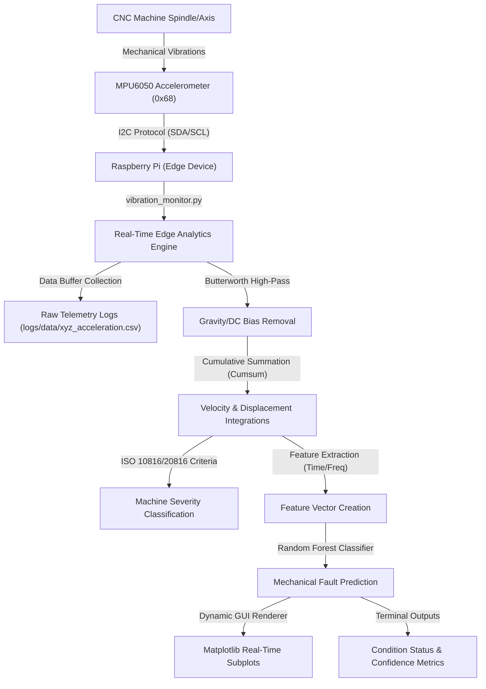

# Vibration-Based Predictive Analysis of CNC Machines
A Real-Time Edge Computing Pipeline using Raspberry Pi, MPU6050, Signal Processing, and Random Forest Machine Learning.

---

## 1. System Overview & Physical Architecture

In modern high-precision manufacturing, Computer Numerical Control (CNC) machines operate under heavy stresses, high spindle speeds, and continuous duty cycles. Unexpected mechanical failures in spindles, bearings, or cutting tools result in costly downtime, ruined workpieces, and expensive repair bills. This project implements a **Vibration-Based Predictive Maintenance (PdM) System** designed to run directly at the edge on a Raspberry Pi connected to an MPU6050 inertial measurement unit (IMU) accelerometer. 



By continuously sampling tri-axial acceleration, computing physical vibration attributes, comparing findings to ISO standards, and scoring features using a pre-trained Random Forest model, this pipeline identifies mechanical anomalies before they escalate into catastrophic equipment failures.

---

## 2. Mathematical & Signal Processing Pipeline

Raw acceleration measurements from low-cost MEMS sensors are highly noisy and contain gravity components and offset biases. To extract physically meaningful metrics, the code executes the following transformations:

### A. High-Pass Filtering
To isolate dynamic structural vibrations from gravity ($9.81\text{ m/s}^2$ or local variations) and low-frequency drift, a digital **Butterworth High-Pass Filter** is applied.
* **Nyquist Frequency ($f_N$):** Defined as half of the sampling rate ($f_s = 100\text{ Hz} \implies f_N = 50\text{ Hz}$).
* **Cutoff Frequency ($f_c$):** Set to $5\text{ Hz}$. Low-frequency vibrations below this threshold (often caused by slow machine translations or gravity tilt) are attenuated.
* **Filtfilt Operation:** A zero-phase filter is achieved by filtering the signal forward and backward, which eliminates phase distortion—essential for aligning time-series signals.

### B. Numerical Integration
Vibration severity standards (like ISO 10816) are primarily written in terms of **Vibration Velocity (RMS)**. Because the sensor only measures acceleration, numerical integration is used to calculate velocity ($v$) and displacement ($d$):
$$v[n] = v[n-1] + a[n] \cdot \Delta t \implies v = \text{cumsum}(a) \cdot \Delta t$$
$$d[n] = d[n-1] + v[n] \cdot \Delta t \implies d = \text{cumsum}(v) \cdot \Delta t$$

> [!WARNING]
> **Integration Drift:** Numerical integration of noisy acceleration data causes errors to accumulate over time, resulting in massive low-frequency offsets (drift). This code mitigates drift by applying the high-pass filter to the acceleration signal *before* performing integrations.

### C. Time and Frequency-Domain Feature Engineering
Machine learning classifiers cannot process raw time-series windows effectively without feature engineering. The script extracts **7 statistical features** per axis to represent the vibration's physical signature:

| Feature Name | Mathematical Description | Industrial Indication |
| :--- | :--- | :--- |
| **RMS Acceleration** | $\sqrt{\frac{1}{N}\sum x_i^2}$ | Overall energy/intensity of vibration. |
| **Kurtosis** | $\frac{\frac{1}{N}\sum(x_i - \bar{x})^4}{\sigma^4} - 3$ | "Peakiness" of the signal. High values indicate sudden impacts (e.g., gear tooth chipping, bearing spalls). |
| **Skewness** | $\frac{\frac{1}{N}\sum(x_i - \bar{x})^3}{\sigma^3}$ | Asymmetry of the vibration wave. Represents directional forces or unbalanced loads. |
| **RMS Velocity** | $\sqrt{\frac{1}{N}\sum v_i^2}$ | Structural fatigue indicator, maps directly to ISO vibration severity guidelines. |
| **RMS Displacement** | $\sqrt{\frac{1}{N}\sum d_i^2}$ | Low-frequency structural stress, loose mounting bolts, or misalignment. |
| **FFT Spectral Energy** | $\frac{1}{M}\sum \|X_k\|^2$ | Cumulative power in the frequency domain. |
| **Dominant Frequency** | $\text{argmax}(\|X_k\|)$ | The frequency at which the machine vibrates most intensely (e.g., matches spindle shaft rotation rate). |

---

## 3. Detailed Line-by-Line Code Walkthrough

Below is a comprehensive breakdown of the logic implemented in [vibration_monitor.py](file:///c:/Users/sirik/Desktop/ME/cnc_vibration_analysis/vibration_monitor.py).

### 1. Module Imports (Lines 1–12)
* **Standard Libraries:** `time`, `os`, `csv`, and `datetime` are imported for telemetry logs, directory management, system timing, and timestamp generation.
* **Libraries for Numerical & Visual Operations:** `numpy` provides optimized vectorized arrays, while `matplotlib.pyplot` renders real-time graphical outputs. `joblib` loads the serialized Random Forest model and MinMaxScaler.
* **Hardware Interfacing:** `mpu6050` reads acceleration registers from the physical sensor via I2C.
* **SciPy Signal & Statistics Processing:** `kurtosis` and `skew` calculate higher-order statistical moments. `rfft` and `rfftfreq` calculate the Real Fast Fourier Transform. `butter` and `filtfilt` construct and execute the high-pass digital filter.

### 2. Configuration & Workspace Setup (Lines 14–27)
* **SAMPLING_RATE ($100\text{ Hz}$):** Sets the measurement frequency.
* **DT ($0.01\text{ s}$):** Time increment between consecutive samples.
* **WINDOW_SIZE ($90$ samples):** Represents a $0.9$-second sliding window used for feature calculations and real-time updating.
* **LABELS:** Defines the target classifications: `Ideal` (Normal machine operation), `Cracking` (Structural fault), `Offset_Pulley` (Rotational misalignment), and `Wear` (Tool/bearing deterioration).
* **Logging Directories:** Automatically initializes `logs/plots` and `logs/data` folders.

### 3. Machine Learning & Hardware Initialization (Lines 25–30)
* Loads `industrial_rf_model.pkl` (the Random Forest classifier) and `industrial_scaler.pkl` (the normalization preprocessor).
* Initializes the `mpu6050` sensor instance at the default I2C address `0x68`.

### 4. Mathematical Functions (Lines 32–68)
* `highpass(...)`: Calculates high-pass filter coefficients using a 4th-order Butterworth configuration, then applies it forward and backward on the target array via `filtfilt`.
* `integrate_velocity(...)` & `integrate_displacement(...)`: Perform numerical integration via cumulative sums (`np.cumsum`) scaled by the time delta `DT`.
* `extract_features(...)`: Takes raw signals, removes the DC offset (mean), applies the high-pass filter, integrates the signal to get velocity and displacement, transforms the signal to the frequency domain using RFFT, finds the dominant frequency peak, and packages all 7 statistical indicators into a flat 1D numpy array.

### 5. Logging and GUI Setup (Lines 70–94)
* Opens the telemetry file `logs/data/xyz_acceleration.csv` and writes the initial header row: `Time, Ax, Ay, Az`.
* Configures `plt.ion()` (Matplotlib interactive mode) to render plots non-blockingly. Creates a figure containing three subplots (Acceleration, Velocity, and Displacement) along the X-axis.
* Declares three buffers (`bx`, `by`, `bz`) as Python lists to store historical values.

### 6. Main Real-Time Monitoring Loop (Lines 97–177)
* `start = time.time()`: Records the loop iteration start time.
* `sensor.get_accel_data()`: Reads the raw three-axis acceleration data package from the MPU6050.
* **Data Appending & Telemetry Logging:** Appends the values to buffers and logs them to the CSV file.
* **Window Evaluation Check (`if len(bx) >= WINDOW_SIZE`):** Once 90 readings have accumulated, the sliding window pipeline begins:
  * Extract the active window (`bx[-WINDOW_SIZE:]`), center it by subtracting the mean, and filter it.
  * Compute velocity and displacement curves.
  * **ISO 10816 Evaluation:** Computes the Root Mean Square (RMS) of velocity in metric units ($g \to \text{m/s} \to \text{mm/s}$ by multiplying by $9.81$ and $1000$ respectively). Categorizes severity into `GOOD`, `SATISFACTORY`, `UNSATISFACTORY`, or `UNACCEPTABLE`.
  * **ML Inferences:** Extracts features for all 3 axes, concatenates them into a single $1 \times 21$ feature vector, scales it using the `scaler` object, and queries the Random Forest classifier for predictions and probabilities (confidence levels).
  * **Real-time Plotting:** Dynamically redraws lines, sets bounds, and refreshes the display.
  * **Save Plots:** Saves a high-resolution snapshot of the system vibration characteristics to disk every 5 seconds.
  * **Print Telemetry:** Prints out the diagnosed machine condition, ISO health assessment status, calculated Velocity RMS, and the classifier's confidence score to the console.
* **Rate Control (`elapsed = time.time() - start`):** Computes how long the iteration took and uses `time.sleep` to throttle execution, ensuring that sampling occurs at exactly $100\text{ Hz}$ without overloading the Raspberry Pi's CPU.

---

## 4. Industrial Deployment & Predictive Maintenance Benefits

Deploying this software pipeline onto a CNC machine using a Raspberry Pi offers substantial structural, economic, and operational advantages.

```
       [ CNC Spindle Vibration ]
                  |
        +---------+---------+
        |                   |
   [Low Severity]     [High Severity]
        |                   |
  (Under 4.5 mm/s)    (Over 4.5 mm/s)
        |                   |
   Continuous       Check ML Diagnosis
   Monitoring       +-------+-------+
                    |               |
               [Ideal/Wear]    [Cracking/Offset]
                    |               |
               Log Warning     Trigger Emergency Stop
```

### Real-Time Alarm Thresholds (ISO 10816 / 20816)
The script automates industrial compliance by assessing vibration levels directly in the loop. The severity classes maps to actionable responses:
* **ISO GOOD (< 1.8 mm/s):** The machine is operating within nominal tolerances.
* **ISO SATISFACTORY (1.8 - 4.5 mm/s):** Safe for long-term operations; scheduled maintenance checks should proceed as normal.
* **ISO UNSATISFACTORY (4.5 - 11.2 mm/s):** Indicates early mechanical wear, misalignment, or bearing degradation. Maintenance crews should inspect the equipment.
* **ISO UNACCEPTABLE (> 11.2 mm/s):** Critical structural stress. Operation should be halted immediately to avoid permanent damage or spindle failure.

### Diagnostic Fault Categorization via Machine Learning
Standard threshold tests only flag *when* a machine is shaking, but they cannot explain *why*. The integrated Random Forest model bridges this gap by categorizing the root cause:
1. **Ideal:** System running within normal parameters.
2. **Cracking:** Structural fracture in frames, brackets, or housing. Shows high-frequency shock spikes (elevated Kurtosis).
3. **Offset Pulley:** Dynamic rotational misalignment of belts or drives. Leads to high radial displacement peaks at fundamental shaft rotation speeds.
4. **Wear:** Bearing spalling or tool chipping. Characterized by elevated overall acceleration RMS and multi-harmonic frequency peaks.

### Economic Value Proposition (ROI)
* **Transitioning from Reactive to Predictive Maintenance:** Instead of running tools to catastrophic failure (reactive) or stopping production to inspect healthy components (preventative), technicians only service machinery when early symptoms are detected.
* **Extending Asset Life:** Aligning offsets and replacing bearings early prevents damage from spreading to the main spindle assembly.
* **Edge Processing and Cloud Independence:** Processing data directly on the Raspberry Pi reduces network bandwidth requirements and allows the system to run locally without depending on cloud servers.

> [!NOTE]
> **Warning on Variable Initialization:** The variable `GROQ_API_KEY` is referenced in the script's placeholder analysis block. If you wish to use local LLM-based diagnostic summaries, ensure you define `GROQ_API_KEY = os.getenv("GROQ_API_KEY", "")` or load it globally to avoid Python throwing a `NameError`.

---

## 5. Software Requirements & Library Evaluation

A `requirements.txt` file is provided in this repository to define all dependencies. Below is a detailed breakdown of each library used, its industrial applications, and its specific role in our CNC vibration pipeline.

### A. NumPy (`numpy`)
* **General Definition:** A fundamental scientific computing library in Python that introduces optimized, homogeneous multi-dimensional array structures (`ndarrays`) along with highly efficient mathematical functions.
* **Industrial Context:** NumPy is the foundational backbone of virtually all data science, machine learning, and hardware telemetry pipelines in modern engineering. It is found in aerospace telemetry analysis, seismic processing, and automated quality control systems.
* **Why Chosen Specifically Here:** Analyzing high-frequency physical systems at $100\text{ Hz}$ generates $300$ data points per second across three axes. Pure Python lists are slow and introduce excessive garbage collection overhead. NumPy arrays execute vectorized operations compiled in C, allowing zero-overhead mathematical operations (such as calculating the mean or scaling signals by gravitational constants) directly on the Raspberry Pi's processor.

### B. SciPy (`scipy`)
* **General Definition:** An advanced engineering library built on top of NumPy, offering comprehensive toolkits for numerical integration, digital signal processing (DSP), optimization, and statistical analysis.
* **Industrial Context:** SciPy is standard in acoustics engineering, signal intelligence, radar processing, control systems design, and laboratory instrumentation.
* **Why Chosen Specifically Here:**
  * **Filtering (`scipy.signal`):** Raw accelerometer data contains structural gravity offsets ($9.81\text{ m/s}^2$ bias) and integration drift. The 4th-order Butterworth filter and zero-phase `filtfilt` forward/backward execution remove this drift without shifting the phase of our waves.
  * **Fourier Analysis (`scipy.fft`):** RFFT transforms time-series acceleration into frequency spectra. Identifying the dominant frequency is critical because matching it with the spindle's rotation rate immediately diagnoses imbalances or shaft offsets.
  * **Statistical Moments (`scipy.stats`):** Measuring skewness and kurtosis allows the detection of shock transients (such as a chipped tool tip or bearing spalls) that don't affect RMS values but spike peak distributions.

### C. Matplotlib (`matplotlib`)
* **General Definition:** A plotting and visualization library designed to render publication-quality graphics, charts, and interactive GUI subplots.
* **Industrial Context:** Used in engineering control rooms, SCADA system dashboards, research labs, and test benches to monitor telemetry streams.
* **Why Chosen Specifically Here:** Matplotlib's interactive plotting mode (`plt.ion()`) allows the system to redraw and scale the 3 subplots (Acceleration, Velocity, and Displacement) on-the-fly. This visual loop feedback is vital for machine operators to diagnose CNC issues visually as they occur.

### D. Joblib (`joblib`)
* **General Definition:** A library optimized for serializing and deserializing large Python objects and NumPy-heavy data structures.
* **Industrial Context:** Joblib is widely used in production pipelines to deploy trained machine learning models from high-performance GPU cloud environments to low-power edge servers.
* **Why Chosen Specifically Here:** Instead of rebuilding or training the Random Forest classifier at runtime on the Raspberry Pi, `joblib.load()` instantly deserializes and maps the saved `.pkl` files into system memory in milliseconds, minimizing startup lag.

### E. Scikit-Learn (`scikit-learn`)
* **General Definition:** A machine learning library offering classification, regression, clustering, and data preprocessing models.
* **Industrial Context:** Scikit-Learn is the leading framework for tabular and structured industrial ML, used in predictive maintenance, credit risk grading, and factory sorting systems.
* **Why Chosen Specifically Here:** While the Random Forest model is pre-trained, the Raspberry Pi requires the library to deserialize, scale incoming features (`scaler.transform`), and run model predictions (`model.predict`) in real-time.

### F. MPU6050 Raspberry Pi (`mpu6050-raspberrypi` & `smbus2`)
* **General Definition:** Specialized driver packages designed to facilitate hardware communication with the MPU6050 accelerometer over I2C. `smbus2` handles low-level Linux System Management Bus communications.
* **Industrial Context:** Found in hardware prototyping, IoT sensor hubs, drone attitude controllers, and smart factory edge nodes.
* **Why Chosen Specifically Here:** Direct register manipulation via raw Linux I2C commands is error-prone. This driver abstracts register addressing, automatically converting raw hexadecimal sensor registers into clean floating-point acceleration values for the $X, Y,$ and $Z$ axes.

